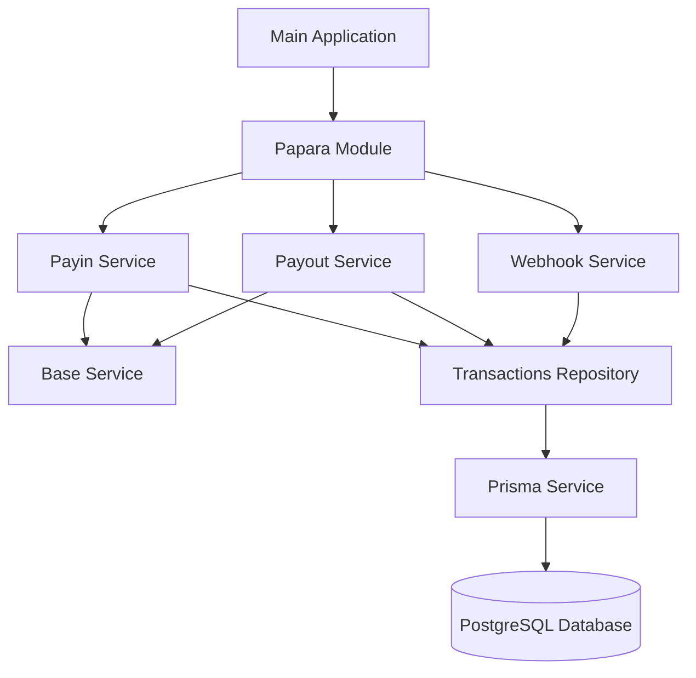

# Decard - Papara Payment Integration Service

## Project Overview

Decard is a NestJS-based payment integration service that connects with Papara, a payment processing platform. The application facilitates both payment collection (payin) and disbursement (payout) operations, while also handling webhook notifications from the payment provider.

## Architecture

### Core Components

The application follows a modular architecture based on NestJS framework principles:



### Key Components

1. **Papara Module**: Central module that orchestrates all payment-related functionality
2. **Payin Service**: Handles payment collection operations
3. **Payout Service**: Manages disbursement operations with balance validation
4. **Webhook Service**: Processes notifications from Papara about transaction status changes
5. **Transactions Repository**: Manages database operations for transactions
6. **Crypto Service**: Handles cryptographic operations for API signing

## API Endpoints

The application exposes the following API endpoints:

### Payment Operations

- **POST /papara/payin**: Create a new payment collection request
  - Accepts payment details and returns a payment token
  - Creates a transaction record in the database

- **POST /papara/payout**: Create a new disbursement request
  - Validates user balance before processing
  - Creates a transaction record and automatically confirms the payout

### Webhook

- **POST /{webhook_route}**: Receives transaction status updates from Papara
  - Route path is configurable via environment variables
  - Validates webhook signature
  - Updates transaction status in the database

## Database Schema

The application uses PostgreSQL with Prisma ORM and includes the following models:

### User Model

```
model User {
  id         Int    @id @default(autoincrement())
  email      String @unique
  first_name String
  last_name  String
  password   String

  transactions Transaction[]
}
```

### Transaction Model

```
model Transaction {
  id         Int               @id @default(autoincrement())
  type       TransactionType   // PAYIN or PAYOUT
  amount     Decimal           @db.Decimal(10, 2)
  orderToken String            @unique
  status     TransactionStatus @default(PENDING)
  number     String?           // Recipient account number for payouts
  userId     Int
  user       User              @relation(fields: [userId], references: [id])
  errorCode  String?
  errorMessage String?
}
```

Transaction statuses include: PENDING, PROCESSING, COMPLETED, FAILED, CANCELED

## Deployment

The application is containerized using Docker and can be deployed using Docker Compose.

### Development Deployment

```bash
# Set up environment variables in .env file
# Then run:
docker compose up --build -d
```

This will:

- Build the Docker image with the development target
- Start the application in development mode with hot-reload
- Run database migrations and seed data
- Mount the local codebase as a volume for live code changes

### Production Deployment

```bash
# Set up environment variables in .env file
# Then run:
docker compose -f docker-compose.prod.yml up --build -d
```

This will:

- Build the Docker image with the production target
- Start the application in production mode
- Run database migrations and seed data
- Use optimized production settings

### Environment Variables

Key environment variables required:

- `DATABASE_URL`: PostgreSQL connection string
- `PORT`: Application port
- `SECRET_KEY`: Secret key for encryption
- `SHOP_KEY`: Papara shop key
- `WEBHOOK_IP_WHITELIST`: Comma-separated list of allowed IPs for webhooks
- `WEBHOOK_ROUTE`: Custom route for webhook endpoint (default: 'webhook')

## Security Features

1. **IP Whitelisting**: Webhook endpoints are protected with IP whitelisting
2. **Signature Verification**: All webhook notifications are verified using cryptographic signatures
3. **Exception Handling**: Comprehensive exception handling with custom error classes
4. **Input Validation**: Request validation using class-validator
